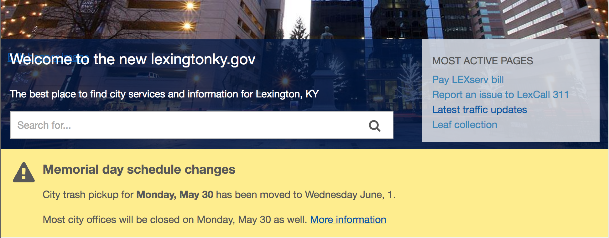

## Adding menu items

## Updating footer

### lexingtonky.gov column

Is automatically displays the top-level menu items.

### Services column

Is managed through `Structure > Menus > Services`

### Site-wide notice

A site-wide notice is a banner that appears on every page for big events like snow emergencies

* To find existing notices (published and unpublished) [search for site-wide notices](https://lexingtonky.gov/admin/content?type=site_wide_notice&title=)
* To make visible, publish them. To hide, unpublish.
* The webmaster role is able to manage them.
